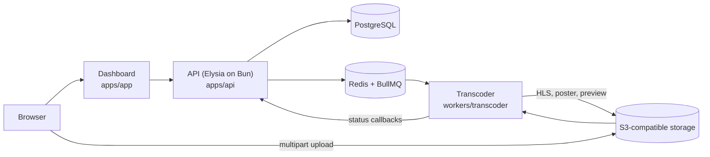

# VidcastX

**Open-source, self-hostable video infrastructure · In development toward V1**

VidcastX takes a video in and hands back an adaptive HLS stream, thumbnails, an embeddable player and webhooks, the way Mux does, but on your own servers and your own S3-compatible storage. Every stage of the pipeline is plain, readable code with docs that explain how video infrastructure works.

MIT-licensed; see [License](#license).


- **What V1 is:** [IDEA.md](IDEA.md), the product definition and scope
- **The plan and progress:** [tasks/todo.md](tasks/todo.md)
- **Docs:** `pnpm dev:docs` → <http://localhost:4002> (fully offline)

## Current status

| Area                   | State                                                                                                                          |
| ---------------------- | ------------------------------------------------------------------------------------------------------------------------------ |
| Auth and organizations | Better Auth sessions, GitHub/Discord OAuth, organizations with Owner/Admin/Member roles.                                       |
| Uploads                | Resumable S3 multipart uploads from the dashboard (Uppy), direct to storage.                                                   |
| Transcoding            | BullMQ worker running FFmpeg: HLS ladder up to 1080p, poster, hover preview, status callbacks to the API.                      |
| Dashboard              | Login, onboarding, folder browser with thumbnails and previews, upload. Several pages are still placeholders.                  |
| Developer API          | Session-authenticated video and folder routes. API keys, playback IDs, signed playback and webhooks are V1 work.               |
| Playback               | No player yet. The player package and the playback endpoint are V1 work.                                                       |
| Tests and CI           | Typecheck, lint, format, unit tests and build gate every PR, plus CodeQL. End-to-end coverage of the real pipeline is V1 work. |
| Deployment             | Docker Compose runs Postgres, Redis and MinIO for local development. Containerised API, worker and dashboard are V1 work.      |

## Architecture



## Repository layout

```text
apps/
  api/          Elysia API: auth, videos, folders, uploads, internal worker routes
  app/          TanStack Start dashboard
  docs/         Fumadocs documentation site (offline)
  studio/       Drizzle Studio launcher
packages/
  auth/         Better Auth configuration
  database/     Drizzle schemas and migrations
  m2m/          Worker-to-API token client
  queue/        BullMQ queues and job contracts
  redis/        Redis client
  storage/      S3-compatible storage helpers
  ui/           Shared UI components and theme
workers/
  transcoder/   FFmpeg HLS worker
scripts/        Repository scripts (worktree setup)
tooling/        Shared ESLint, Prettier and TypeScript configuration
```

## Local development

### Prerequisites

- Node.js 22.13+ (CI uses the version in `.node-version`)
- pnpm 11 (`corepack enable pnpm`)
- Bun (version in `.bun-version`)
- Docker with Docker Compose
- FFmpeg, for the transcoder worker

### Setup

```bash
git clone https://github.com/pixelactstudio/vidcastx.git
cd vidcastx
cp .env.example .env
pnpm install
docker compose up -d
pnpm db:migrate
pnpm dev
```

| Service       | URL                             |
| ------------- | ------------------------------- |
| Dashboard     | <http://localhost:4000>         |
| API           | <http://localhost:4001>         |
| OpenAPI       | <http://localhost:4001/openapi> |
| Docs          | <http://localhost:4002>         |
| MinIO console | <http://localhost:9001>         |
| PostgreSQL    | `localhost:5432`                |
| Redis         | `localhost:6380`                |

The example configuration is for local development only; replace every example secret before using a shared environment.

### Parallel branches with worktrees

```bash
pnpm worktree:new feat/my-feature   # new worktree from origin/dev, env files copied, deps installed
pnpm worktree:setup                 # inside a worktree created by another tool (T3 Code, Claude Code, …)
```

Postgres, Redis and MinIO are shared by all worktrees. Dev servers use fixed ports, so run them in one worktree at a time.

### Checks

```bash
pnpm check-types
pnpm lint
pnpm format
pnpm test
```

CI runs the same checks plus a full build on every pull request.

## Contributing

Branch from `dev`, open a pull request into `dev`, and use a [Conventional Commits](https://www.conventionalcommits.org) title. `main` is the release branch; release-please turns the commits merged there into versioned releases and a changelog. Repository conventions live in [CLAUDE.md](CLAUDE.md) and `.claude/rules/`.

## Security

Do not report vulnerabilities in public issues. Use [GitHub private vulnerability reporting](https://github.com/pixelactstudio/vidcastx/security/advisories/new) or the contact route in [.github/SECURITY.md](.github/SECURITY.md).

## License

[MIT](LICENSE) © 2024-2026 Pixelact Studio.
