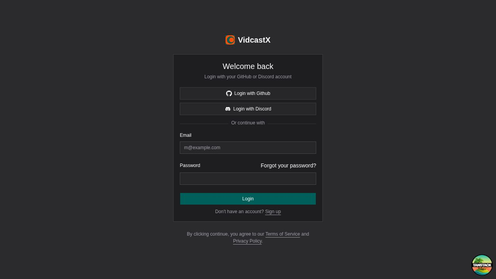
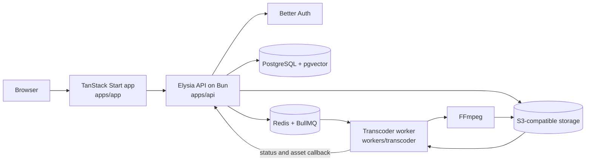

# VidcastX

**In development · Platform experiment**

VidcastX is an open-source, self-hostable video platform: organization-scoped uploads, HLS transcoding, and playback. The repository contains a working application shell, API, local infrastructure, and an FFmpeg-based HLS worker, but it is not a production-ready video platform and the full upload-to-playback path has not yet been verified as one repeatable deployment.

It is MIT-licensed; see [License](#license).



## Current status

| Area                                      | Repository reality                                                                                                                                                                               |
| ----------------------------------------- | ------------------------------------------------------------------------------------------------------------------------------------------------------------------------------------------------ |
| Authentication and organizations          | Better Auth integration, sessions, OAuth configuration, organizations, and role models exist in the application and shared auth package.                                                         |
| Video library                             | Draft creation, organization-scoped listing, folders, metadata controls, soft deletion, and upload UI are implemented in source.                                                                 |
| Uploads                                   | S3-compatible multipart upload helpers and API routes are implemented.                                                                                                                           |
| Processing                                | A BullMQ worker downloads source media, invokes FFmpeg, writes adaptive HLS output, generates a poster and hover preview, uploads assets, and reports status to the API.                         |
| Playback                                  | Playback URLs and studio UI integration exist, but a clean end-to-end upload, transcode, and browser playback run is still a release blocker.                                                    |
| Tests                                     | Lint, formatting, and typechecks are established. API controller tests and a small frontend unit-test baseline exist; coverage is still thin and CI does not prove the real infrastructure path. |
| AI, live streaming, billing, and webhooks | Database models and product ideas exist. Complete user-facing implementations do not.                                                                                                            |
| Deployment                                | Local dependencies are described with Docker Compose. Production deployment, secrets, migrations, observability, backups, and rollback are not codified.                                         |

The longer-term product direction is preserved in [IDEA.md](IDEA.md). That file is a vision document, not a description of the current tree. The grounded work queue is in [TODO.md](TODO.md).

## Architecture in the repository



This diagram reflects the checked-in implementation. It does not include the proposed player package, AI worker fleet, live-streaming services, billing service, marketing application, or production infrastructure described as future direction in `IDEA.md`.

## Repository layout

```text
apps/
  api/          Elysia API, auth mount, OpenAPI, video and internal worker routes
  app/          TanStack Start creator application
  studio/       Drizzle Studio launcher
packages/
  analytics/    Shared analytics adapters
  auth/         Better Auth configuration
  database/     Drizzle schemas and migrations
  m2m/          Worker-to-API JWT helpers
  queue/        BullMQ queue and job contracts
  redis/        Redis client
  seo/          Shared metadata helpers
  storage/      S3-compatible storage helpers
  ui/           Shared UI primitives and theme styles
workers/
  transcoder/   FFmpeg VOD/HLS processing worker
tooling/        Shared lint, formatting, and TypeScript configuration
```

## Local development

### Prerequisites

- Node.js 22.13 or newer
- pnpm 11
- Bun
- Docker with Docker Compose
- FFmpeg for the transcoder worker

### Setup

```bash
git clone https://github.com/pixelactstudio/vidcastx.git
cd vidcastx
cp .env.example .env
pnpm install
docker compose up -d
pnpm db:migrate
pnpm dev
```

Default local endpoints:

- App: <http://localhost:4000>
- API: <http://localhost:4001>
- OpenAPI: <http://localhost:4001/openapi>
- MinIO console: <http://localhost:9001>
- PostgreSQL: `localhost:5432`
- Redis: `localhost:6380`

The example configuration is for local development only. Replace all example secrets and credentials before using any shared environment.

Useful focused commands:

```bash
pnpm dev:app
pnpm dev:api
pnpm db:studio
```

## Validation

```bash
pnpm test
pnpm check-types
pnpm lint
pnpm format
pnpm lint:ws
```

These checks validate source-level behavior. They do not replace an end-to-end run against PostgreSQL, Redis, object storage, the queue, FFmpeg, and a browser.

## What remains before a production claim

- Prove and automate the complete upload → queue → transcode → asset callback → playback path.
- Add integration coverage for PostgreSQL, Redis/BullMQ, S3-compatible storage, and worker failure/retry behavior.
- Expand frontend and worker tests beyond the current narrow baseline.
- Codify deployment, secret management, database migrations, health checks, observability, backups, and rollback.
- Clear or explicitly accept all dependency advisories, then keep the dependency automation green.
- Capture authenticated product and completed-playback screenshots from a reproducible demo environment.

## Contribution and branch model

Contributions are welcome. Changes are reviewed through pull requests into `dev`; `main` is the release branch. Follow the repository conventions in [CLAUDE.md](CLAUDE.md) and `.claude/rules/`.

## Security

Do not report vulnerabilities in public issues. Use [GitHub private vulnerability reporting](https://github.com/pixelactstudio/vidcastx/security/advisories/new) or the contact route in [.github/SECURITY.md](.github/SECURITY.md).

## License

[MIT](LICENSE) © 2024-2026 Pixelact Studio.
